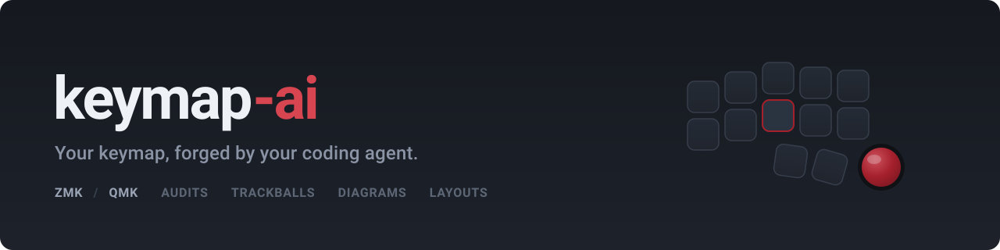
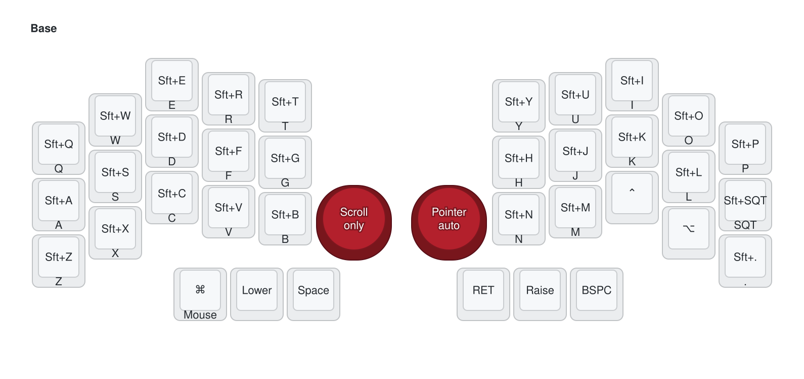
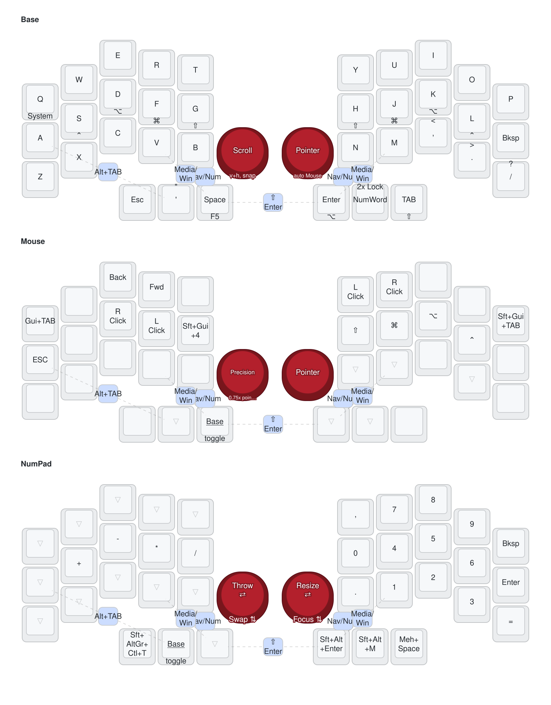
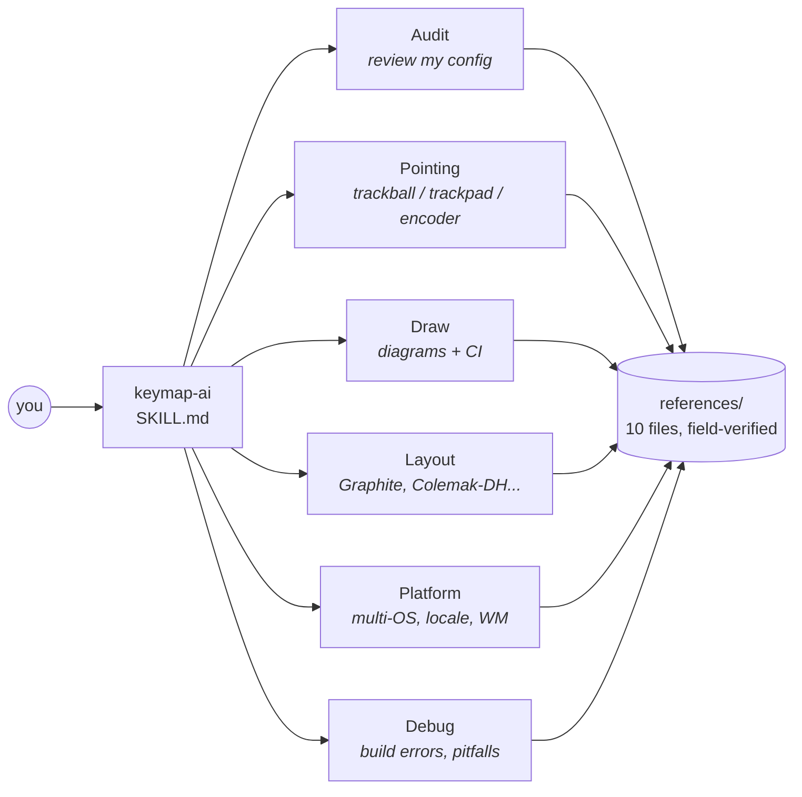
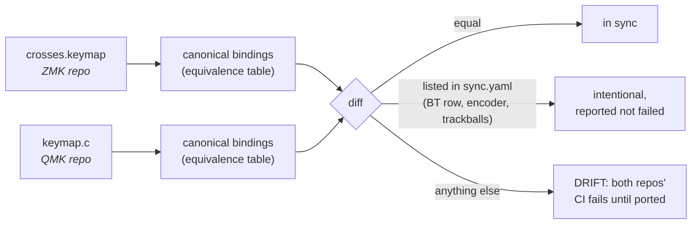

<p align="center">
  
</p>

<p align="center">
  <a href="LICENSE"></a>
  
  
  
</p>

An [Agent Skill](https://agentskills.io) that turns your coding agent into a custom-keyboard firmware expert. Audit your ZMK or QMK config, tune home row mods that never misfire, make trackballs and trackpads layer-aware, wire your window manager to ball flicks, localize for your language and OS, generate per-layer keymap diagrams with CI, keep multiple boards in sync across ZMK and QMK with a drift-checking CI script, and debug the failures the docs don't cover.

Works with Claude Code, Codex CLI, Cursor, Gemini CLI, opencode, and any other harness supporting the Agent Skills standard.

## Install

```bash
npx skills add johncattrall/keymap-ai
```

That detects your installed agents (Claude Code, Codex, Cursor, Gemini CLI, opencode, ...) and adds the skill to each.

Codex users can alternatively install it as a skill-only plugin:

```
codex plugin marketplace add johncattrall/keymap-ai
```

or from inside Codex: `$skill-installer install https://github.com/johncattrall/keymap-ai/tree/main/skills/keymap-ai`

Manual fallback: copy `skills/keymap-ai/` into your agent's skills directory (e.g. `~/.claude/skills/` or `~/.agents/skills/`).

## A real before and after

These are not mockups. The "before" is the actual first commit of a real Crosses config; the "after" is the same keyboard today, evolved through this skill's audit-and-apply loop in a single day. Both images are drawn by the skill's own pipeline.



*Before: the initial commit. Hold-any-key-for-shift at 200 ms, lower/raise layer locks, one trackball permanently a pointer and the other permanently scroll.*



*After: timeless home row mods, combos for momentary layers, a smart NumWord thumb (tap for numbers, auto-exits), an auto-raised mouse layer with mirrored clicks and mod-click home row, a full numpad layer, and both trackballs layer-aware: snapped scroll and pointer on base, precision mode on Mouse, window throw/resize gestures on the pad layer.*

Getting there is conversational: **"audit my config"** produces layer tables, a combo map, and findings ranked by payoff, each with a failure scenario, the fix, and which half to reflash; then apply them one reversible commit at a time.

## How it routes



Everything is intent-routed from natural language; no commands to memorize. The skill reads your actual config before advising, states its assumptions, and verifies version-sensitive claims against live docs instead of asserting from memory.

## Keeping two boards in sync

One layout, two firmwares: `scripts/sync_keymaps.py` reduces both keymaps to the same canonical form and diffs them in CI, so the boards stay independently editable but cannot silently drift apart.



The equivalence table knows that `&hml LCTRL S` and `LCTL_T(KC_S)` are the same key, that ZMK autoshift equals a plain tap under QMK's global autoshift, that mod chords match side-insensitively, and that a ZMK transparent key equals a QMK explicit one on default-layer alternates where transparency cannot fall through. `references/sync.md` has the porting checklist behind it.

## Coverage

| Area | What's inside |
|---|---|
| Boards | Splits, unibody, dongle topologies; 30-key minimalists to 60+; advice calibrated to key count |
| Behaviors | Timeless home row mods, smart layers (numword), caps word, tap-dance hybrids, mod-morphs, autoshift trade-offs, travel soft-off |
| Pointing | Trackballs, Cirque trackpads, PS/2 trackpoints: per-layer processing, scroll with axis snapping, precision modes, motion-to-keypress gestures |
| Other hardware | Rotary encoders (per-layer bindings), OLED/nice!view displays, RGB, status widgets |
| Platform | macOS/Windows/Linux modifier conventions, multi-OS profile+layer switching, window manager tables (Amethyst, Rectangle, AeroSpace, yabai, i3/sway, Hyprland, komorebi), dictation-collision checks, per-half battery levels on the host |
| International | Locale keycode headers (zmk-locale-generator), unicode input per OS, dead-key gotchas, non-US shifted pairs |
| Layouts | Any published layout: curated guidance for Colemak-DH, Graphite, Gallium, Canary, Dvorak, plus spec-driven generation for Workman, Sturdy, Focal, Engram, Hands Down, Semimak, APT and others |
| Tooling | keymap-drawer diagrams (per-layer, dark-mode aware, trackballs drawn in place), GitHub Actions integration, README generation |
| Multi-board | ZMK<->QMK porting via a verified equivalence table, plus a CI drift checker (`sync_keymaps.py`) that keeps two boards' layouts in sync |
| Debugging | Build-error playbooks plus a 22-entry field-verified pitfall database |

## Support tiers

| Firmware | Tier | Meaning |
|---|---|---|
| ZMK | **Stable** | Recipes hardware-verified on wireless splits with pointing devices |
| QMK | **Stable** | Audit, behaviors (tap-hold/Achordion, tap dance, combos, key overrides, autoshift), layouts and diagrams hardware-verified on an RP2040 split. Pointing recipes still deferred |


## What's inside

```
.codex-plugin/plugin.json   Codex skill-only plugin manifest
skills/keymap-ai/
  SKILL.md                  intent routing: audit / apply / pointing / draw / layout / platform / debug
  references/
    audit-zmk.md              the audit checklist (behaviors, structure, system layer, locale, power)
    audit-qmk.md              the QMK equivalent
    behaviors-zmk.md          timeless HRM, smart layers, mod-morphs, soft off
    behaviors-qmk.md          tap-hold tuning, Caps Word, key overrides
    pointing-zmk.md           per-layer motion processing: listener semantics, gestures
    devices-zmk.md            trackpads, trackpoints, encoders, displays, dongles, RGB
    os-and-locale.md          multi-OS patterns, window managers, international layouts
    modules-zmk.md            west.yml cookbook for community modules
    layouts.md                alt-layout guidance and generation
    diagrams.md               keymap-drawer + CI + README conventions
    pitfalls.md             22 field-verified failure modes with fixes
    debug.md                build-error and hardware-symptom playbooks
  scripts/
    draw_zmk.py             deterministic parse/augment/draw pipeline
    sync_keymaps.py         ZMK<->QMK layout drift checker for CI
```

## Why this exists

The hardest knowledge in custom keyboard firmware lives in folklore: hold-tap tuning that actually works, input-listener child-node ordering, smart-layer continue-list rules, which module fork has which devicetree options, why your mouse layer captures input. This skill encodes that folklore, sourced from real hardware debugging, so the next person doesn't pay for it in evenings.

## Contributing

Contributions are very welcome, especially: pitfalls you hit (symptom, cause, fix), QMK hardware test reports, locale and layout corrections, module cookbook updates when revisions move, and device recipes for hardware we haven't covered (encoder-heavy boards, dongles, trackpoint builds). See [CONTRIBUTING.md](CONTRIBUTING.md).

## Credits

Standing on the shoulders of the community: [ZMK](https://zmk.dev), [QMK](https://qmk.fm), [urob](https://github.com/urob) (timeless HRM, zmk-auto-layer), [caksoylar](https://github.com/caksoylar/keymap-drawer) (keymap-drawer), [joelspadin](https://github.com/joelspadin/zmk-locale-generator) (locale tooling), [getreuer](https://getreuer.info/posts/keyboards/) (QMK userspace patterns), [infused-kim](https://github.com/infused-kim/kb_zmk_ps2_mouse_trackpoint_driver) (trackpoint driver), [itouuuuuuuuu](https://github.com/itouuuuuuuuu/zmk-battery-bar) and [carlosedp](https://github.com/carlosedp/zmk-split-battery) (per-half battery apps for macOS and Windows), and the module authors credited in `references/modules-zmk.md`.

## License

[MIT](LICENSE)
